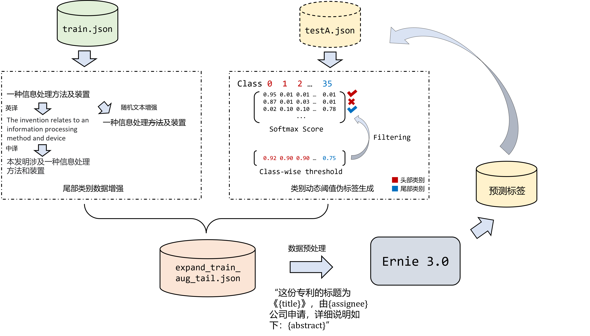

# CCF-BDCI 小样本数据分类任务

## 赛题链接

[CCF-BDCI 小样本数据分类任务](https://www.datafountain.cn/competitions/582/)

## 参赛成绩

队伍 / 人数 1426 / 1764

A榜 0.65159296，6/468

B榜 0.59547145，9/108

递补到第5名进入决赛

## 参赛选手

- 队长：李一鸣，中国科学院计算技术研究所，[liyiming22s1@ict.ac.cn](mailto:liyiming22s1@ict.ac.cn)
- 队员 1：张兆，中国科学院计算技术研究所，[zhaozhao809@163.com](mailto:zhaozhao809@163.com)
- 队员 2：李想，中国科学院自动化研究所，[2300049883@qq.com](mailto:2300049883@qq.com)
- 队员 3：赵家乐，中国科学院计算技术研究所，[1007613549@qq.com](mailto:1007613549@qq.com)

## 算法说明

- 公开数据：仅使用官方训练集及部分官方A榜测试集（伪标签）进行模型训练，未使用任何外部数据。
- 预训练模型：百度ernie-3.0-base [https://huggingface.co/nghuyong/ernie-3.0-base-zh](https://huggingface.co/nghuyong/ernie-3.0-base-zh)
- 算法流程图：
- 伪标签产生流程

  传统的伪标签处理方法通常预先选定一个阈值 $c$，若模型对于测试样本的第 $i$ 类的 softmax 分数大于 $c$，则认为模型对于该样本的预测是较为可靠的，并将该样本连同其伪标签 $i$ 加入到训练集中。

  在我们的做法中，我们考虑到训练数据集存在长尾分布，不再对于所有类别使用同一个固定阈值 $c$，而是为每一个类别 $i$ 设置一个单独的阈值 $c_i$。在确定第 $i$ 类数据的伪标签阈值 $c_i$ 时，我们首先筛选出所有预测标签为 $i$ 的样本及其 softmax 分数，并将其按照 softmax 分数降序排列，选择第 $\alpha$ 分位数（即从大到小排序在第 $\alpha$ 的分数）的 softmax 分数作为阈值 $c_i$，若此时产生的 $c_i$ 小于一个固定阈值 $fix\_thresh$，则将其修正为 $c_i^* = fix\_thresh$。代码参见[add_pseudo_labels.py](./add_pseudo_labels.py)，生成的伪标签扩展数据集文件以"expand_train_"作为前缀 （如 `expand_train_cur_best.json`）。
- 数据增强流程
  解决方案主要对官方训练数据集 `train.json`中的尾部类别（12，22，32，35）进行如下两类数据增强：

  - 使用英语、法语、德语、日语、韩语五门语言对其进行**回译**。代码参见 `data/code/own_code/back_trans.py`，生成的扩展数据集文件为 `trans_aug_tail.json`。
  - 使用 **ChineseEDA**进行随机删除、增加、同义词替换等。代码参见 `data/code/own_code/eda.py`，生成的扩展数据集文件为 `eda_data.json`。

  将生成的 `trans_aug_tail.json`及 `eda_aug_tail.json`文件拼接在（经伪标签扩展）的训练数据集文件后，得到最终的训练文件，如在伪标签扩展的 `expand_train_cur_best.json`文件后拼接 `trans_aug_tail.json`、`eda_aug_tail.json`文件得到训练文件 `expand_train_cur_best_aug_tail.json`。
- B榜测试数据预处理流程

  A、B 榜测试数据均直接送入模型进行推理，无特殊预处理。

## 训练测试和预测流程

### 大文件分享链接

### Docker训练测试和预测流程

训练、测试流程参见 `image/README.md`。

### Python训练测试和预测流程

### 安装依赖项

**使用的Python版本为3.8.13**

```bash
pip install -r data/code/requirements.txt
```

#### 直接推理

```bash
cd data/code/inference
bash inference_submit.sh
```

会调用 `data/user_data/models`内部的9个模型进行推理，输出的结果文件在 `data/prediction_result`中，名称为 `finalB.csv`

**由于推理使用的机器可能不同，结果可能有一点点差异**

提交版本是 `NVIDIA GeForce RTX 2080 Ti 11G * 2`进行推理后得到的结果，如果在 `NVIDIA Tesla V100 32G * 4`上进行推理，最终结果有两条预测不同

#### 训练

```bash
cd data/code/train
bash 2022_10_22_19_12_04-3-0.62876738448.sh
bash 2022_10_27_07_38_29_3-0.63077875449-8.sh
bash 2022_11_01_04_26_32-3-0.63293263685.sh
bash 2022_11_03_19_41_25-a-0.63234589689.sh
bash 2022_11_05_05_55_17-0-0.62600679310.sh
bash 2022_11_06_04_35_15-a-0.62673116125.sh
bash 2022_11_06_19_08_24-a-.sh
```

训练注意事项：

1. 如果GPU的数量足够，上面的7个脚本可以并行运行，更改GPU卡号在每个文件的第四行 `GPU='0 1 2 3'`
2. 训练过程大部分是在 `NVIDIA Tesla V100 32G * 4`上进行的，其中第2个脚本 `bash 2022_10_27_07_38_29_3-0.63077875449-8.sh`是在 `NVIDIA Tesla V100 32G * 8`上进行的。也就是说，训练的硬件条件最少需要 `NVIDIA Tesla V100 32G * 8`
3. 训练后的模型存放在 `data/user_data/models_after_train`中，**注意虽然生成的模型数量大于9，但是在后面推理的时候仅用到了其中的9个模型**
4. 有输出日志，存放在 `data/user_data/log`内部

#### 使用训练后的模型进行推理

```bash
cd data/code/inference
bash inference_submit_after_train.sh
```

会调用 `data/user_data/models_after_train`内部的9个模型进行推理，调用的9个模型名称写在 `data/code/inference/inference_submit_after_train.sh`内部，输出的结果文件在 `data/prediction_result`中，名称为 `finalB.csv`
